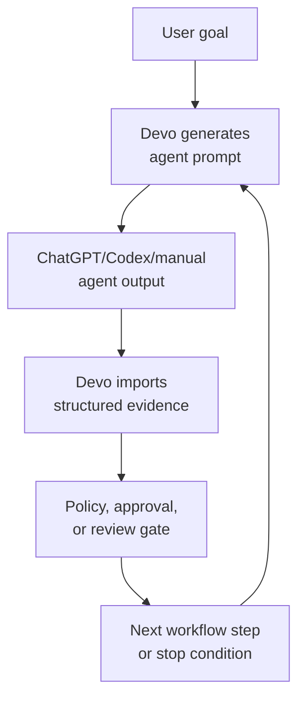

# Agent Workflow

## Simple Meaning

In current Devo, an agent is not a separate running bot.

An agent is:

- a role
- a prompt template
- a rule set
- an expected input/output contract
- a workflow step

ChatGPT or Codex manually acts as that agent, then imports the output into Devo.

Future Devo may run agents directly through model adapters. Later, agents could become separate automated workers. Today, they are structured roles that keep manual AI work consistent and recoverable.

Current priority: keep the manual/Codex agent workflow excellent before adding direct API agents. Devo should reduce repeated prompting, improve operator prompts, store evidence, and make next actions obvious through CLI commands first. Direct OpenAI, Claude, Gemini, or local model adapters are later and optional; they should not make API token spend mandatory for normal development.

## Manual-Assisted Agent Flow

Source/freshness: this diagram reflects the current file-based agent workflow as of TASK-DEVO-053A. Update it when Devo starts executing agents directly through model adapters.

## Why Agents Exist

Agents split development work into questions:

- What is this project?
- Is the context safe?
- What is the goal?
- What are the requirements?
- What is the plan?
- Is the plan safe?
- What tasks should be done?
- What should Codex implement?
- Did validation pass?
- Is the code acceptable?
- Can the task close?
- Is Git delivery ready?

This makes the workflow easier to audit and resume.

## Current Agents

### ProjectContextDiscoveryAgent

What it does: summarizes a project from safe scan results and approved source documents.

Question it answers: "What is this project, how is it structured, and what should Devo know before managing it?"

Safety value: creates bounded project context without reading secrets or local settings.

### ProjectContextReviewerAgent

What it does: reviews discovered project context for completeness, safety, and missing information.

Question it answers: "Is this context safe and complete enough to approve?"

Safety value: prevents bad or incomplete project context from becoming the baseline.

### IdeaAnalystAgent

What it does: explores the run goal and identifies useful directions, risks, and constraints.

Question it answers: "What is the user really asking for, and what should we consider before requirements?"

Safety value: catches unclear scope early.

### RequirementsAgent

What it does: turns the goal and idea analysis into clear requirements.

Question it answers: "What must be true when this run is done?"

Safety value: separates requirements from implementation guesses.

### PlannerAgent

What it does: proposes a plan for satisfying the requirements.

Question it answers: "How should we approach the work?"

Safety value: makes dependencies, validation, and boundaries explicit before code changes.

### PlanReviewerAgent

What it does: reviews the plan for safety, completeness, and scope fit.

Question it answers: "Is this plan safe to execute?"

Safety value: catches risky or vague plans before task decomposition.

### ReplannerAgent

What it does: revises a plan when validation, review, or changed facts show the original plan is wrong.

Question it answers: "How should the plan change now that we know more?"

Safety value: avoids improvising after surprises.

### TaskDecomposerAgent

What it does: breaks a reviewed plan into tasks, dependencies, risk notes, validation needs, and implementation boundaries.

Question it answers: "What exact task should be done first, and under what limits?"

Safety value: gives policy and approval checks something concrete to evaluate.

### ImplementationCoordinatorAgent

What it does: prepares Codex-ready implementation instructions for one selected task.

Question it answers: "What should the worker do, and what should it not touch?"

Safety value: turns a task into a bounded work order.

### ValidatorAgent

What it does: reviews validation evidence after implementation.

Question it answers: "Did the requested validation actually run, and did it pass?"

Safety value: separates doing the work from proving the work.

### CodeReviewerAgent

What it does: reviews implementation evidence and code/diff evidence when available.

Question it answers: "Does this change look correct, scoped, and maintainable?"

Safety value: catches regressions, unreviewed scope expansion, and missing validation.

### FixAgent

What it does: plans or performs a focused fix after validation or review finds a problem.

Question it answers: "What is the smallest safe correction?"

Safety value: keeps follow-up fixes scoped instead of turning them into broad rewrites.

### FinalAuditorAgent

What it does: checks the full evidence trail before task closure.

Question it answers: "Can this task be closed honestly?"

Safety value: prevents closing work with missing validation, unresolved review findings, or unclear delivery state.

### GitDeliveryAgent

What it does: checks Git readiness and delivery evidence before commit/push decisions.

Question it answers: "Is the repo ready to deliver, and what exactly should be staged?"

Safety value: avoids staging forbidden paths, secrets, workspace artifacts, caches, or unrelated files.

## Workflow Phases

### Phase 1: Define Roles And Workflow

Devo first defined agent roles, prompt templates, and expected artifacts. The priority was clear process over automation.

### Phase 2: Store State, Approvals, Validation, And Reports

Devo then added persistent project state, run state, task state, policy checks, approval records, validation registry/runs, Git delivery checks, reports, handoffs, context updates, and backups.

### Phase 3: Codex Manually Follows Agent Roles

This is the current practical mode. Codex and ChatGPT act as the agents, create outputs, import evidence, and follow Devo's safety rails.

### Phase 4: Work Packages, History, And Generated Visuals

This is the current product-maturity phase. Work packages, approval bundles, phase prompts, completion status, work history, project activity, and generated visual reports should make the CLI workflow smooth enough for repeated real use.

### Phase 5: Dashboard Planning And MVP

The dashboard should come after CLI state and generated reports are reliable. It should read Devo structured data and artifacts instead of becoming a separate source of truth.

### Phase 6: Direct Automated Agent Execution Later

Later, Devo may call model adapters directly. Agents may become automated workers. That should happen only after the CLI-first file-based workflow, safety rules, approvals, validation, and recovery trail are reliable. Manual/Codex mode must remain available.
