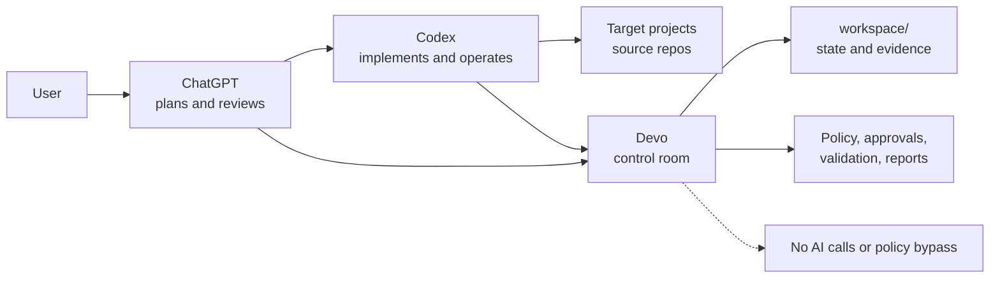

# Devo Vision

## What Devo Is

Devo is not the AI.

Devo is the development control room for AI-assisted software work. It keeps the plan, the rules, the approvals, the validation evidence, the Git delivery evidence, and the handoff trail in one recoverable place.

The roles are:

- ChatGPT: architect, planner, reviewer, and reasoning partner.
- Codex: worker, coder, operator, and validator inside the local workspace.
- Devo: manager, guard, record keeper, and workflow memory.
- Target projects: the actual software Devo manages, such as PersonalOS.

Devo should make AI-assisted development feel controlled instead of improvised.

## Current Product Priority

Devo itself is now the main product to improve. Target projects are important because they keep Devo honest, but they are not the current product focus.

PersonalOS remains the primary real-world test project. Use it to validate Devo workflows against a real app with real constraints: source edits, approvals, registered validation, delivery evidence, reports, generated visuals, and recovery. Do not treat PersonalOS feature work as the main priority unless a specific approved task says so.

The current product strategy is CLI-first and local-first:

- Codex/Desktop/CLI acts as the AI worker.
- Devo CLI manages state, scope, policy, approvals, validation, delivery, reports, history, and recovery.
- Current development does not require OpenAI, Claude, Gemini, or local model API tokens.
- Direct model adapters are future scope and should be cost-controlled.
- Manual/Codex mode must remain supported even after direct agents exist.
- Dashboard/UI should come after the CLI workflow is mature enough to be worth visualizing.

## Control Room Model

Source/freshness: this diagram reflects the current Devo architecture described in this document and `docs/current-state.md` as of TASK-DEVO-053A. Update it when Devo adds a dashboard, direct model adapters, or a materially different control boundary.

## Why Devo Exists

AI coding work can be useful, but it gets messy when the work spans many turns, crashes, approvals, builds, target repositories, and recovery steps.

Without Devo, the user has to keep too much in chat memory:

- what project is active
- what was approved
- what was forbidden
- what validation ran
- what changed
- what still needs to happen
- whether the repo is clean
- what to do after a crash

Devo exists to move that memory into files and deterministic commands.

It solves four practical problems:

1. Context loss: reports and handoffs let work resume after chat loss or crashes.
2. Safety drift: policy checks, approvals, and validation records keep risky work explicit.
3. Evidence drift: validation, review, delivery, and context artifacts stay attached to a run.
4. Repeated prompting: agent roles and workflow state make the next step easier to reconstruct.

## What Devo Should Eventually Feel Like

The target experience is simple:

1. The user gives one goal.
2. Devo and Codex prepare a scoped work package.
3. The user approves the package once.
4. Codex implements, validates, commits, and pushes inside that scope.
5. The user gets a short final summary with links to evidence.

The user should not have to paste the same safety rules every turn. The user should not have to approve every tiny file when the scope is already clear. The user should not have to reconstruct a run from chat history.

Devo should feel like a calm project manager that knows the project, remembers the rules, and keeps Codex inside the lane.

## Why The Current Workflow Felt Too Manual

The current workflow is safe, but it is still too chat-heavy:

- Agent outputs are often written manually.
- Approval requests are separate for source edits and build validation.
- Similar safety text is repeated often.
- Reports can be verbose.
- Codex has to bridge gaps between Devo workflow state and real work.
- Devo has strong backend/control features but not yet enough product workflow.

This is expected for the current phase. Devo first proved the control plane: project context, runs, agents, policies, approvals, validation, Git delivery, reports, and recovery. The next phase should reduce friction.

## Desired Future Flow

For normal low-risk maintenance:

1. User: "Improve these PersonalOS UI help states."
2. Devo creates a work package with files, scope, risks, validation, and stop conditions.
3. User approves the package.
4. Codex performs the approved work.
5. Devo runs approved validation through the registered command.
6. Codex commits and pushes.
7. Devo writes a compact final report.

For risky work, Devo should still stop and ask. Good automation is not fewer rules; it is fewer repeated words around the same rules.
