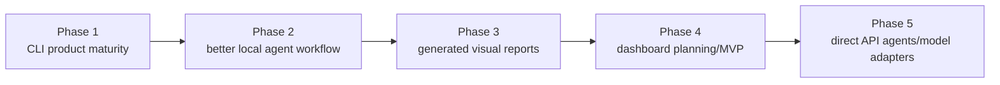

# Usability Roadmap

## Current Usability Problem

Devo has many of the backend/control features it needs, but the user experience is still too manual.

The pain points are:

- too much ChatGPT/Codex back-and-forth
- too many approval gates for small work
- too much repeated prompt text
- too much output and reporting
- manual agent output imports
- first-class work packages exist, but they are still MVP CLI flows
- no saved working modes
- the first read-only dashboard MVP exists
- no direct model/agent adapters

This makes Devo safe but not yet smooth.

The current focus is Devo product maturity, not PersonalOS feature delivery. PersonalOS remains useful as a real-world validation target, but the product being improved now is Devo itself. The active remaining sequence is tracked in `docs/remaining-roadmap.md`.

## Visual Roadmap

Source/freshness: this diagram reflects the usability direction as of TASK-DEVO-053A. Update it when dashboard work or direct model/agent adapters become active implementation tracks.



## Target Improvements

### CLI-First Product Maturity - Current Focus

Devo should mature as a CLI-first, local-first product before UI or direct agent automation becomes the main work.

Current development should improve:

- status and next-action commands
- guided project onboarding
- current-context shortcuts
- work packages and approval bundles
- project workflow defaults
- operator prompts and handoff prompts
- validation and delivery evidence
- history, activity, UI-ready read models, generated visual reports, and recovery

Codex/Desktop/CLI is the AI worker for now. Devo manages workflow and evidence. No direct API tokens are required for current development.

The long-term direction is documented in `docs/devo-company-model.md`: Devo should become a local software-development company operating system around AI workers. The next major usability layer should support project brief intake, blueprint/backlog/task generation, batch approval, execution queue, progress tracking, and pause/resume around Codex usage limits. The prioritized task order is documented in `docs/remaining-roadmap.md`.

TASK-DEVO-074 starts that layer with deterministic Project Brief and Blueprint artifacts plus read-only planning status. TASK-DEVO-075 adds deterministic Backlog and Task artifacts plus read-only backlog counts. TASK-DEVO-076 adds a Codex/manual backlog refinement prompt and safe refined-backlog import path. TASK-DEVO-077 adds planning Batch artifacts and deterministic batch selection. Progress calculation, execution queue, and richer progress views are still next.

### Work Packages - MVP Added

A work package is one approved batch of related work.

It is limited by scope, risk, and validation method, not by file count.

A work package can contain:

- 3 to 5 related tasks, issues, bugs, or requirements
- one complete same-pattern cleanup group
- one feature or requirement that touches multiple files

Examples:

- all direct MudBlazor `Title` to `title` warning fixes
- one UI maintenance batch across related screens
- one docs-only project context update
- one small feature with source edit plus build validation

The package should include:

- goal
- allowed files or areas
- exact allowed patterns when known
- exclusions
- validation command
- stop conditions
- delivery expectations

The MVP writes `work-package.json`, `work-package.md`, and `operator-prompt.md` under the run workspace artifacts folder.

### Saved Lanes - Expanded MVP Added

A lane is a saved working mode.

Examples:

- `docs-only`
- `low-risk-ui-maintenance`
- `warning-cleanup`
- `small-bugfix`
- `small-feature`
- `test-only`
- `backup-maintenance`
- `devo-internal-source`

Each lane stores rules once:

- allowed work types
- forbidden work types
- default validation command ids or categories
- lane notes and stop conditions via generated scope templates

Then the user can say, "Use the warning-cleanup lane," or "Use the docs-only lane," instead of repeating all rules.

Lanes are guidance and defaults. They do not bypass approval bundles, child approval records, validation command policy checks, or explicit approval for risky work.

### Project Workflow Defaults - MVP Added

Project settings let each registered project remember its normal operating defaults:

- default work lane
- default validation command
- default full-test command
- default branch
- automatic scope-template behavior
- delivery mode
- notes

This lets a routine package start with:

```powershell
devo work new --project PersonalOS --goal "Prepare a small UI maintenance batch"
```

instead of repeating the lane and validation assumptions every time. Defaults are Devo workspace metadata and do not modify the target project.

### Guided Project Onboarding - MVP Added

Project setup now has a single read-only checklist:

```powershell
devo project onboard --project PersonalOS
devo project onboard --project PersonalOS --suggest-settings
```

The command summarizes registration, path, scan, context approval, validation registry, project settings, doctor status, and the next setup action. It helps a user get from "registered project" to "ready for `work new`" without remembering every setup command. Settings still require an explicit `devo project settings-set` command; onboarding does not mutate target project files.

### Current Context Shortcuts - MVP Added

Saved context makes common commands feel less ceremonial:

```powershell
devo use --project DevOrchestrator
devo work new --goal "Improve CLI defaults"
devo use --project DevOrchestrator --run <runId>
devo work resume
devo work status
devo work next
devo project activity
devo doctor
```

`devo current` shows the selected project/run and whether they still exist. Shortcuts print when they use saved context, and fail with `devo use` guidance when project or run context is missing.

### UI-Ready Read Models - MVP Added

Before building a dashboard, Devo now exposes read-only overview models for future UI/API use:

```powershell
devo project overview --project DevOrchestrator --json
devo project activity --project DevOrchestrator --json
devo work status --run <runId> --json
devo doctor --project DevOrchestrator --json
```

These models summarize project, run, and work-package state without requiring a UI to scrape raw workspace folders. Dashboard/UI remains future scope; the read models are the stable data-contract bridge.

The UI/API architecture plan is documented in [UI/API architecture](ui-architecture.md). The first dashboard scope is documented in [UI MVP specification](ui-mvp-spec.md). Devo now has a local-only read-only API backend (`devo api serve`) and a polished React/Vite read-only dashboard MVP under `ui/`, so the recommended path is: improve read-model performance and coverage, keep the CLI complete, then add controlled write actions only after the Devo approval and policy model is preserved in the UI.

### Approval Bundles - MVP Added

An approval bundle lets one user approval cover a scoped group of actions:

- source edit within the work package
- build validation for the registered command
- optionally Git delivery after validation passes

Child approvals still exist in Devo's records. A bundle is not a safety bypass. It is a better user interface for approving related steps at once.

If the scope changes, the bundle should stop matching.

### Operator Prompts

An operator prompt is a compact Codex-ready prompt generated from Devo state.

It should include:

- project
- run id
- task id
- approved scope
- allowed files
- forbidden areas
- validation commands
- stop conditions
- final report requirements

This reduces repeated chat instructions.

### Short Final Reports

Final reports should be brief by default:

- what changed
- validation result
- commit hash
- push result
- final status
- next recommended step

Detailed reports should remain available as Devo artifacts, not pasted into every chat response.

### One-Command Style Workflow

The current MVP command group is:

```powershell
devo work new --project PersonalOS --goal "Improve operational UI guidance"
devo work new --project PersonalOS --lane low-risk-ui-maintenance --goal "Improve operational UI guidance"
devo use --project PersonalOS --run <runId>
devo work resume
devo work resume --project PersonalOS --run <runId>
devo work scope-template --project PersonalOS --run <runId>
devo work import-scope --project PersonalOS --run <runId> --file <scopeMarkdownFile>
devo work request-approval-bundle --project PersonalOS --run <runId> --task T001
devo approval bundle-approve --project PersonalOS --run <runId> --bundle <bundleId> --by Manas
```

Devo should guide the user through the package rather than requiring them to remember every lower-level command. `devo work new` creates the run/package/template in one step, uses a configured project default lane when `--lane` is omitted, and `devo work resume` reads state and evidence and tells Codex or the user the next safe phase and exact commands.

### Dashboard Or UI

A future dashboard should show:

- registered projects
- project overview and onboarding state
- active runs and work packages
- validation history
- Git delivery readiness
- backup health
- generated report and visual links
- next recommended action

The CLI should stay complete, but a UI would make Devo easier to operate.

Do not turn the scaffold into a write/action dashboard too early. UI-ready read models, generated visual reports, structured activity summaries, the [UI/API architecture plan](ui-architecture.md), and the [UI MVP specification](ui-mvp-spec.md) should keep shaping the dashboard, because they prove the data model, page scope, and safety model a fuller UI would later render.

The current dashboard polish direction is calmer layout, clearer selected-dashboard-project versus CLI-current-context labeling, section-level loading for slow overview/doctor checks, quieter Activity evidence lists, and safe CLI command suggestions for missing work-package artifacts. The API now supports opt-in timing breakdowns with `include_timing=true`, and the first performance pass removed duplicate overview work and bounded slow optional checks. Read-model snapshot caching remains a future performance task, not part of the first profiling pass.

Local UI ergonomics now include `devo ui info`, `devo ui urls`, `devo ui status`, and `devo ui open`. These helpers make the read-only dashboard easier to find and check without starting/stopping processes or adding browser-side write actions.

The dashboard now also has a controlled action safety model. `/api/actions` and the Action Safety page classify read-only actions, workspace-safe UI v2 actions, approval-required deferred actions, and dangerous blocked actions. TASK-DEVO-072 enables four confirmed workspace-only artifact writes: scope template, work-package visual, project activity visual, and onboarding report. TASK-DEVO-073 adds a confirmed work bootstrap action that creates Devo run/work-package draft artifacts and an optional scope template. This keeps the next UI phase grounded in explicit metadata instead of ad hoc browser-side mutations.

### Direct Model And Agent Adapters

Later, Devo may run agents directly through model adapters.

That should come after:

- work packages
- lanes
- approval bundles
- operator prompts
- reliable validation and recovery

Direct agent execution should use the same policy, approval, validation, and evidence model. It should not be a bypass around it.

Possible adapters include OpenAI, Claude, Gemini, and local models. API token cost should be explicit and controlled. Manual/Codex mode must remain supported.

## Near-Term Priority

The best next usability improvements are:

1. Improve CLI-first product maturity: global status/activity, clearer next actions, and tighter reports.
2. Expand local agent workflow: handoff prompt generation, task templates, and interrupted-work recovery/resume.
3. Expand generated visual reports only where they clarify current work.
4. Plan dashboard/UI later from the structured Devo data model.
5. Add direct model adapters later, after manual/Codex mode is smooth and cost controls are clear.
