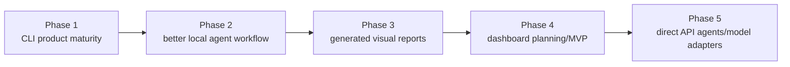

# Usability Roadmap

## Current Usability Problem

Devo has many of the backend/control features it needs, but the user experience is still too manual.

The pain points are:

- too much ChatGPT/Codex back-and-forth
- too many approval gates for small work
- too much repeated prompt text
- too much output and reporting
- manual agent output imports
- first-class work packages exist, but they are still MVP CLI flows
- no saved working modes
- the first read-only dashboard MVP exists
- no direct model/agent adapters

This makes Devo safe but not yet smooth.

The current focus is Devo product maturity, not PersonalOS feature delivery. PersonalOS remains useful as a real-world validation target, but the product being improved now is Devo itself. Phase 1 MVP is complete and checkpointed in `docs/phase-1-mvp-checkpoint.md`; the active Phase 2 autonomy plan is `docs/phase-2-autonomy-roadmap.md`.

## Visual Roadmap

Source/freshness: this diagram reflects the usability direction as of TASK-DEVO-053A. Update it when dashboard work or direct model/agent adapters become active implementation tracks.



## Target Improvements

### CLI-First Product Maturity - Current Focus

Devo should mature as a CLI-first, local-first product before UI or direct agent automation becomes the main work.

Current development should improve:

- status and next-action commands
- guided project onboarding
- current-context shortcuts
- work packages and approval bundles
- project workflow defaults
- operator prompts and handoff prompts
- validation and delivery evidence
- history, activity, UI-ready read models, generated visual reports, and recovery

Codex/Desktop/CLI is the AI worker for now. Devo manages workflow and evidence. No direct API tokens are required for current development.

The long-term direction is documented in `docs/devo-company-model.md`: Devo should become a local software-development company operating system around AI workers. The next major usability layer should support project brief intake, blueprint/backlog/task generation, batch approval, execution queue, progress tracking, and pause/resume around Codex usage limits. The prioritized task order is documented in `docs/remaining-roadmap.md`.

TASK-DEVO-074 starts that layer with deterministic Project Brief and Blueprint artifacts plus read-only planning status. TASK-DEVO-075 adds deterministic Backlog and Task artifacts plus read-only backlog counts. TASK-DEVO-076 adds a Codex/manual backlog refinement prompt and safe refined-backlog import path. TASK-DEVO-077 adds planning Batch artifacts and deterministic batch selection. TASK-DEVO-078 adds deterministic count-based progress summaries and a read-only dashboard Progress card. TASK-DEVO-079 adds execution queue state tracking and read-only queue summaries. TASK-DEVO-080 adds Codex-ready handoff prompts and read-only handoff summaries. TASK-DEVO-081 adds the first dedicated read-only Planning Intake page for the full planning pipeline. TASK-DEVO-082 adds detailed read-only Blueprint and Backlog pages. TASK-DEVO-083 adds detailed read-only Batch, Queue, Handoff, and Progress pages. TASK-DEVO-084 adds explicit workspace-only Batch approval/review artifacts and decisions. TASK-DEVO-085 proves the full planning pipeline through dogfood, TASK-DEVO-086 tightens the main operator guidance and input robustness issues found there, TASK-DEVO-087 documents the future Codex worker adapter safety model, TASK-DEVO-088 adds worker run tracking without implementing Codex automation, TASK-DEVO-089 adds manual worker report templates/import as review evidence, TASK-DEVO-090 adds a read-only Worker Runs page for detailed review visibility, TASK-DEVO-091 adds read-only preflight checks and run-plan previews for future supervised Codex execution, TASK-DEVO-092 adds the first guarded one-run Codex CLI execution prototype, TASK-DEVO-093 adds a queue-first worker preparation shortcut, TASK-DEVO-094 adds explicit worker review and validation-evidence records before any queue completion, TASK-DEVO-095 gates queue completion on that review evidence, TASK-DEVO-096 dogfoods the full supervised worker flow with a fake no-op Codex command, TASK-DEVO-097 polishes the operator flow with explicit `--codex-path`, completed-item evidence visibility, and `flow-summary`, TASK-DEVO-098 adds the first real Codex supervised dry-run checklist, TASK-DEVO-099 documents the first real launch attempt and WindowsApps path failure, TASK-DEVO-100 adds read-only Codex executable doctor diagnostics plus launch-failure handling, TASK-DEVO-101 confirms the next usability gap is safe wrapper/launcher setup before another real retry, TASK-DEVO-102 adds explicit wrapper diagnostics/templates and fake-tested wrapper execution without `shell=True`, TASK-DEVO-103 adds the launcher setup runbook/readiness checklist, TASK-DEVO-104 designs the delivery safety layer before commit/push automation, TASK-DEVO-105 implements read-only delivery readiness checks, TASK-DEVO-106 implements delivery plan/approval artifacts, TASK-DEVO-107 adds delivery report plus commit-message preparation, TASK-DEVO-108 adds guarded CLI-only commit, TASK-DEVO-109 adds guarded CLI-only push, TASK-DEVO-110 dogfoods the full guarded delivery path against an isolated temp repo/local bare remote, TASK-DEVO-111 adds delivery operator polish plus a read-only Delivery page, TASK-DEVO-113 adds delivery report refresh/reopen guidance after retryable guarded commit failures, TASK-DEVO-114 adds read-only delivery commit diagnostics for index-lock and permission failures, TASK-DEVO-115 closes the live delivery dogfood with the normal-PowerShell operating rule, TASK-DEVO-116 adds automatic guarded-commit index-lock preflight before staging, TASK-DEVO-116A reduces docs/README secret-risk false positives while preserving real-secret blockers, TASK-DEVO-117 adds a read-only `delivery latest` shortcut for latest useful delivery state, TASK-DEVO-118 adds a trusted local runner so restricted contexts can hand one guarded delivery command to normal PowerShell, TASK-DEVO-120 polishes runner latest/status output so operators can find and run the newest pending trusted delivery command without remembering IDs, TASK-DEVO-121 adds intake status/template/prompt helpers for moving a rough idea into the planning pipeline without AI/API calls or target mutation, TASK-DEVO-124 records the Phase 1 MVP checkpoint, TASK-DEVO-125 defines the Phase 2 autonomy roadmap, TASK-DEVO-126 adds one-shot trusted runner watch mode, TASK-DEVO-127 adds explicit scheduled/background trusted runner management without adding UI delivery controls or new AI-agent behavior, TASK-DEVO-128 adds bounded batch execution policies as approval contracts for future queue automation, TASK-DEVO-129 adds a policy-gated queue-worker loop that prepares one approved queue item and pauses at handoff/worker readiness, and TASK-DEVO-130 adds status, pause, resume, fail, retry, and cancel lifecycle controls for that loop.

TASK-DEVO-131 adds the next CLI usability bridge: evidence inspection, explicit queue-worker continuation through worker report/review/validation gates, and trusted delivery runner request creation without running Codex, validation, queue completion, commit, or push.

### Work Packages - MVP Added

A work package is one approved batch of related work.

It is limited by scope, risk, and validation method, not by file count.

A work package can contain:

- 3 to 5 related tasks, issues, bugs, or requirements
- one complete same-pattern cleanup group
- one feature or requirement that touches multiple files

Examples:

- all direct MudBlazor `Title` to `title` warning fixes
- one UI maintenance batch across related screens
- one docs-only project context update
- one small feature with source edit plus build validation

The package should include:

- goal
- allowed files or areas
- exact allowed patterns when known
- exclusions
- validation command
- stop conditions
- delivery expectations

The MVP writes `work-package.json`, `work-package.md`, and `operator-prompt.md` under the run workspace artifacts folder.

### Saved Lanes - Expanded MVP Added

A lane is a saved working mode.

Examples:

- `docs-only`
- `low-risk-ui-maintenance`
- `warning-cleanup`
- `small-bugfix`
- `small-feature`
- `test-only`
- `backup-maintenance`
- `devo-internal-source`

Each lane stores rules once:

- allowed work types
- forbidden work types
- default validation command ids or categories
- lane notes and stop conditions via generated scope templates

Then the user can say, "Use the warning-cleanup lane," or "Use the docs-only lane," instead of repeating all rules.

Lanes are guidance and defaults. They do not bypass approval bundles, child approval records, validation command policy checks, or explicit approval for risky work.

### Project Workflow Defaults - MVP Added

Project settings let each registered project remember its normal operating defaults:

- default work lane
- default validation command
- default full-test command
- default branch
- automatic scope-template behavior
- delivery mode
- notes

This lets a routine package start with:

```powershell
devo work new --project PersonalOS --goal "Prepare a small UI maintenance batch"
```

instead of repeating the lane and validation assumptions every time. Defaults are Devo workspace metadata and do not modify the target project.

### Guided Project Onboarding - MVP Added

Project setup now has a single read-only checklist:

```powershell
devo project onboard --project PersonalOS
devo project onboard --project PersonalOS --suggest-settings
```

The command summarizes registration, path, scan, context approval, validation registry, project settings, doctor status, and the next setup action. It helps a user get from "registered project" to "ready for `work new`" without remembering every setup command. Settings still require an explicit `devo project settings-set` command; onboarding does not mutate target project files.

### Current Context Shortcuts - MVP Added

Saved context makes common commands feel less ceremonial:

```powershell
devo use --project DevOrchestrator
devo work new --goal "Improve CLI defaults"
devo use --project DevOrchestrator --run <runId>
devo work resume
devo work status
devo work next
devo project activity
devo doctor
```

`devo current` shows the selected project/run and whether they still exist. Shortcuts print when they use saved context, and fail with `devo use` guidance when project or run context is missing.

### UI-Ready Read Models - MVP Added

Before building a dashboard, Devo now exposes read-only overview models for future UI/API use:

```powershell
devo project overview --project DevOrchestrator --json
devo project activity --project DevOrchestrator --json
devo work status --run <runId> --json
devo doctor --project DevOrchestrator --json
```

These models summarize project, run, and work-package state without requiring a UI to scrape raw workspace folders. Dashboard/UI remains future scope; the read models are the stable data-contract bridge.

The UI/API architecture plan is documented in [UI/API architecture](ui-architecture.md). The first dashboard scope is documented in [UI MVP specification](ui-mvp-spec.md). Devo now has a local-only read-only API backend (`devo api serve`) and a polished React/Vite read-only dashboard MVP under `ui/`, so the recommended path is: improve read-model performance and coverage, keep the CLI complete, then add controlled write actions only after the Devo approval and policy model is preserved in the UI.

### Approval Bundles - MVP Added

An approval bundle lets one user approval cover a scoped group of actions:

- source edit within the work package
- build validation for the registered command
- optionally Git delivery after validation passes

Child approvals still exist in Devo's records. A bundle is not a safety bypass. It is a better user interface for approving related steps at once.

If the scope changes, the bundle should stop matching.

### Operator Prompts

An operator prompt is a compact Codex-ready prompt generated from Devo state.

It should include:

- project
- run id
- task id
- approved scope
- allowed files
- forbidden areas
- validation commands
- stop conditions
- final report requirements

This reduces repeated chat instructions.

### Worker Run Tracking - MVP Added

Worker run records make manual Codex handoff attempts visible without launching Codex:

```powershell
devo worker codex run-create --project DevOrchestrator --handoff H001
devo worker codex run-list --project DevOrchestrator
devo worker codex run-status --project DevOrchestrator --run WR001 --status waiting_review --note "Manual session stopped."
```

The record captures source handoff/queue/item/batch/task references, scope, safety boundaries, current status, next action, and report metadata. It is deliberately not proof of completion. Queue completion and any commit/push automation remain separate safety-gated actions.

Manual report import is now the assisted-handoff bridge:

```powershell
devo worker codex report-template --project DevOrchestrator --run WR001
devo worker codex report-validate --project DevOrchestrator --run WR001 --file report-WR001.json
devo worker codex report-import --project DevOrchestrator --run WR001 --file report-WR001.json
devo worker codex report-show --project DevOrchestrator --run WR001
```

The import stores worker-reported status, summary, changed files, validation/tests/commands, safety warnings, blockers, follow-ups, and notes under `workspace/projects/<project>/workers/codex/reports/`. It does not run Codex, execute target commands, validate, commit, push, complete queue items, or prove delivery.

Worker review records now separate review and validation evidence from queue completion:

```powershell
devo worker codex review-template --project DevOrchestrator --run WR001
devo worker codex review-attach-evidence --project DevOrchestrator --run WR001 --status passed --summary "Validation passed."
devo worker codex review-record --project DevOrchestrator --run WR001 --status reviewed_passed --reviewer "Manas" --note "Safe to complete manually."
devo worker codex review-show --project DevOrchestrator --run WR001
devo worker codex review-list --project DevOrchestrator
```

Review records store reviewer decisions and manual validation evidence under `workspace/projects/<project>/workers/codex/reviews/`. They do not run validation, complete queue items, complete tasks, commit, push, or prove delivery by themselves. A passed review prints the explicit `queue-complete-item` command when linked queue context exists, so the final transition remains intentional. `queue-complete-item` is now review-aware: linked/waiting-review items require `reviewed_passed` evidence by default, and failed validation evidence blocks completion. The `--confirm-without-review` override is explicit, discouraged, and recorded in queue notes.

The supervised worker dogfood is documented in `docs/dogfood/devo-supervised-worker-dogfood-096.md`. It proves the fake-worker path end to end. TASK-DEVO-097 resolves the main operator friction found there before real Codex worker usage or delivery automation.

The first real supervised Codex launch should follow `docs/runbooks/codex-launcher-setup.md` and `docs/runbooks/real-codex-supervised-dry-run.md`. Those runbooks keep the first real run no-op/docs-only, target DevOrchestrator first, and treat success as evidence that the launcher, approval, preview, execution, report, and review gates worked rather than as implementation productivity.

TASK-DEVO-099 found that the detected WindowsApps `codex.exe` path can pass preflight/preview but fail at `CreateProcess` with access denied. TASK-DEVO-100 blocked that path and catches launch failures; TASK-DEVO-101 found no safe real launcher on this machine; TASK-DEVO-102 adds the wrapper strategy; TASK-DEVO-103 documents launcher setup. The next real retry should only proceed after the setup checklist is complete and `devo worker codex doctor` reports a safe real executable or wrapper launcher.

Run-plan previews are now the safe preparation layer before any future supervised Codex launch:

```powershell
devo worker codex preflight --project DevOrchestrator --run WR001
devo worker codex preflight --project DevOrchestrator --run WR001 --codex-path E:\tools\fake-codex.cmd
devo worker codex preflight --project DevOrchestrator --run WR001 --codex-wrapper E:\tools\codex-wrapper.cmd
devo worker codex run-plan --project DevOrchestrator --run WR001
devo worker codex run-plan --project DevOrchestrator --run WR001 --codex-path E:\tools\fake-codex.cmd
devo worker codex run-plan --project DevOrchestrator --run WR001 --codex-wrapper E:\tools\codex-wrapper.cmd
devo worker codex run-plan-show --project DevOrchestrator --plan RP001
```

Preflight checks readiness and optional Codex launcher presence with safe detection only. Normal use can rely on PATH when doctor is clean; dogfood/testing can pass `--codex-path`; operators can pass `--codex-wrapper` for a local wrapper created outside committed source. Run plans store a safe command preview, launcher type/path/source/resolution notes, scope, validation expectations, blocked reasons, warnings, and next action guidance. They do not execute Codex, target commands, validation, Git delivery, or queue/task transitions.

The first supervised execution command is now intentionally narrow:

```powershell
devo worker codex execute-preview --project DevOrchestrator --run WR001 --plan RP001
devo worker codex execute --project DevOrchestrator --run WR001 --plan RP001 --confirm-execute
devo worker codex execute-log --project DevOrchestrator --run WR001
```

TASK-DEVO-093 adds the queue-first operator shortcut for that flow:

```powershell
devo worker codex prepare-next --project DevOrchestrator --queue Q001
devo worker codex queue-status --project DevOrchestrator --queue Q001
devo worker codex queue-status --project DevOrchestrator --queue Q001 --item QI001
devo worker codex flow-summary --project DevOrchestrator --queue Q001
```

The shortcut prepares one linked handoff, worker run, and run plan, then stops for approval/execution review. A successful worker exit moves the linked queue item to `waiting_review`, not completed, so the user still performs review, validation, and explicit `queue-complete-item` afterward. After completion, `queue-status` keeps showing the latest completed item's worker/report/review context, while `flow-summary` provides the compact next-command view.

It requires an approved run plan and explicit confirmation, launches one Codex process, captures logs, and moves the worker run to review/failure/pause/block state only. It does not complete queue/tasks, run validation, commit, push, or add UI execute buttons.

### Short Final Reports

Final reports should be brief by default:

- what changed
- validation result
- commit hash
- push result
- final status
- next recommended step

Detailed reports should remain available as Devo artifacts, not pasted into every chat response.

### One-Command Style Workflow

The current MVP command group is:

```powershell
devo work new --project PersonalOS --goal "Improve operational UI guidance"
devo work new --project PersonalOS --lane low-risk-ui-maintenance --goal "Improve operational UI guidance"
devo use --project PersonalOS --run <runId>
devo work resume
devo work resume --project PersonalOS --run <runId>
devo work scope-template --project PersonalOS --run <runId>
devo work import-scope --project PersonalOS --run <runId> --file <scopeMarkdownFile>
devo work request-approval-bundle --project PersonalOS --run <runId> --task T001
devo approval bundle-approve --project PersonalOS --run <runId> --bundle <bundleId> --by Manas
```

Devo should guide the user through the package rather than requiring them to remember every lower-level command. `devo work new` creates the run/package/template in one step, uses a configured project default lane when `--lane` is omitted, and `devo work resume` reads state and evidence and tells Codex or the user the next safe phase and exact commands.

### Dashboard Or UI

A future dashboard should show:

- registered projects
- project overview and onboarding state
- active runs and work packages
- validation history
- Git delivery readiness
- backup health
- generated report and visual links
- next recommended action

The CLI should stay complete, but a UI would make Devo easier to operate.

Do not turn the scaffold into a write/action dashboard too early. UI-ready read models, generated visual reports, structured activity summaries, the [UI/API architecture plan](ui-architecture.md), and the [UI MVP specification](ui-mvp-spec.md) should keep shaping the dashboard, because they prove the data model, page scope, and safety model a fuller UI would later render.

The current dashboard polish direction is calmer layout, clearer selected-dashboard-project versus CLI-current-context labeling, section-level loading for slow overview/doctor checks, quieter Activity evidence lists, and safe CLI command suggestions for missing work-package artifacts. The API now supports opt-in timing breakdowns with `include_timing=true`, and the first performance pass removed duplicate overview work and bounded slow optional checks. Read-model snapshot caching remains a future performance task, not part of the first profiling pass.

Local UI ergonomics now include `devo ui info`, `devo ui urls`, `devo ui status`, and `devo ui open`. These helpers make the read-only dashboard easier to find and check without starting/stopping processes or adding browser-side write actions.

The dashboard now also has a controlled action safety model. `/api/actions` and the Action Safety page classify read-only actions, workspace-safe UI v2 actions, approval-required deferred actions, and dangerous blocked actions. TASK-DEVO-072 enables four confirmed workspace-only artifact writes: scope template, work-package visual, project activity visual, and onboarding report. TASK-DEVO-073 adds a confirmed work bootstrap action that creates Devo run/work-package draft artifacts and an optional scope template. This keeps the next UI phase grounded in explicit metadata instead of ad hoc browser-side mutations.

### Direct Model And Agent Adapters

Later, Devo may run agents directly through model adapters.

That should come after:

- work packages
- lanes
- approval bundles
- operator prompts
- reliable validation and recovery

Direct agent execution should use the same policy, approval, validation, and evidence model. It should not be a bypass around it.

Possible adapters include Codex CLI/Desktop, OpenAI, Claude, Gemini, and local models. API token cost should be explicit and controlled. Manual/Codex mode must remain supported. The Codex CLI worker adapter design is documented in `docs/codex-worker-adapter-design.md`; implementation should start with worker run/report artifacts and manual report import before any supervised process launch.

## Near-Term Priority

The best next usability improvements are:

1. Improve CLI-first product maturity: global status/activity, clearer next actions, and tighter reports.
2. Expand local agent workflow: handoff prompt generation, task templates, and interrupted-work recovery/resume.
3. Expand generated visual reports only where they clarify current work.
4. Plan dashboard/UI later from the structured Devo data model.
5. Continue delivery visibility polish only after more dogfood; keep commit/push execution CLI-only.
6. Retry supervised Codex CLI launch only after doctor reports a safe real executable or wrapper launcher.
7. Add direct model adapters later, after manual/Codex mode is smooth and cost controls are clear.
