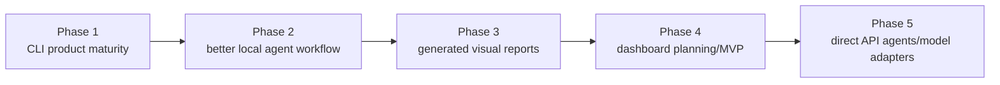

# Usability Roadmap

## Current Usability Problem

Devo has many of the backend/control features it needs, but the user experience is still too manual.

The pain points are:

- too much ChatGPT/Codex back-and-forth
- too many approval gates for small work
- too much repeated prompt text
- too much output and reporting
- manual agent output imports
- first-class work packages exist, but they are still MVP CLI flows
- no saved working modes
- no dashboard UI
- no direct model/agent adapters

This makes Devo safe but not yet smooth.

The current focus is Devo product maturity, not PersonalOS feature delivery. PersonalOS remains useful as a real-world validation target, but the product being improved now is Devo itself.

## Visual Roadmap

Source/freshness: this diagram reflects the usability direction as of TASK-DEVO-053A. Update it when dashboard work or direct model/agent adapters become active implementation tracks.



## Target Improvements

### CLI-First Product Maturity - Current Focus

Devo should mature as a CLI-first, local-first product before UI or direct agent automation becomes the main work.

Current development should improve:

- status and next-action commands
- work packages and approval bundles
- operator prompts and handoff prompts
- validation and delivery evidence
- history, activity, generated visual reports, and recovery

Codex/Desktop/CLI is the AI worker for now. Devo manages workflow and evidence. No direct API tokens are required for current development.

### Work Packages - MVP Added

A work package is one approved batch of related work.

It is limited by scope, risk, and validation method, not by file count.

A work package can contain:

- 3 to 5 related tasks, issues, bugs, or requirements
- one complete same-pattern cleanup group
- one feature or requirement that touches multiple files

Examples:

- all direct MudBlazor `Title` to `title` warning fixes
- one UI maintenance batch across related screens
- one docs-only project context update
- one small feature with source edit plus build validation

The package should include:

- goal
- allowed files or areas
- exact allowed patterns when known
- exclusions
- validation command
- stop conditions
- delivery expectations

The MVP writes `work-package.json`, `work-package.md`, and `operator-prompt.md` under the run workspace artifacts folder.

### Saved Lanes - Expanded MVP Added

A lane is a saved working mode.

Examples:

- `docs-only`
- `low-risk-ui-maintenance`
- `warning-cleanup`
- `small-bugfix`
- `small-feature`
- `test-only`
- `backup-maintenance`
- `devo-internal-source`

Each lane stores rules once:

- allowed work types
- forbidden work types
- default validation command ids or categories
- lane notes and stop conditions via generated scope templates

Then the user can say, "Use the warning-cleanup lane," or "Use the docs-only lane," instead of repeating all rules.

Lanes are guidance and defaults. They do not bypass approval bundles, child approval records, validation command policy checks, or explicit approval for risky work.

### Approval Bundles - MVP Added

An approval bundle lets one user approval cover a scoped group of actions:

- source edit within the work package
- build validation for the registered command
- optionally Git delivery after validation passes

Child approvals still exist in Devo's records. A bundle is not a safety bypass. It is a better user interface for approving related steps at once.

If the scope changes, the bundle should stop matching.

### Operator Prompts

An operator prompt is a compact Codex-ready prompt generated from Devo state.

It should include:

- project
- run id
- task id
- approved scope
- allowed files
- forbidden areas
- validation commands
- stop conditions
- final report requirements

This reduces repeated chat instructions.

### Short Final Reports

Final reports should be brief by default:

- what changed
- validation result
- commit hash
- push result
- final status
- next recommended step

Detailed reports should remain available as Devo artifacts, not pasted into every chat response.

### One-Command Style Workflow

The current MVP command group is:

```powershell
devo work start --project PersonalOS --lane low-risk-ui-maintenance --goal "Improve operational UI guidance"
devo work resume --project PersonalOS --run <runId>
devo work scope-template --project PersonalOS --run <runId>
devo work import-scope --project PersonalOS --run <runId> --file <scopeMarkdownFile>
devo work request-approval-bundle --project PersonalOS --run <runId> --task T001
devo approval bundle-approve --project PersonalOS --run <runId> --bundle <bundleId> --by Manas
```

Devo should guide the user through the package rather than requiring them to remember every lower-level command. `devo work resume` is the current CLI-first version of that idea: after `work start`, it reads state and evidence and tells Codex or the user the next safe phase and exact commands.

### Dashboard Or UI

A future dashboard should show:

- registered projects
- active runs
- pending approvals
- validation history
- Git delivery readiness
- latest handoff
- next recommended action

The CLI should stay complete, but a UI would make Devo easier to operate.

Do not start the dashboard too early. Generated visual reports and structured activity summaries should come first, because they prove the data model a dashboard would later render.

### Direct Model And Agent Adapters

Later, Devo may run agents directly through model adapters.

That should come after:

- work packages
- lanes
- approval bundles
- operator prompts
- reliable validation and recovery

Direct agent execution should use the same policy, approval, validation, and evidence model. It should not be a bypass around it.

Possible adapters include OpenAI, Claude, Gemini, and local models. API token cost should be explicit and controlled. Manual/Codex mode must remain supported.

## Near-Term Priority

The best next usability improvements are:

1. Improve CLI-first product maturity: global status/activity, clearer next actions, and tighter reports.
2. Expand local agent workflow: handoff prompt generation, task templates, and interrupted-work recovery/resume.
3. Expand generated visual reports only where they clarify current work.
4. Plan dashboard/UI later from the structured Devo data model.
5. Add direct model adapters later, after manual/Codex mode is smooth and cost controls are clear.
